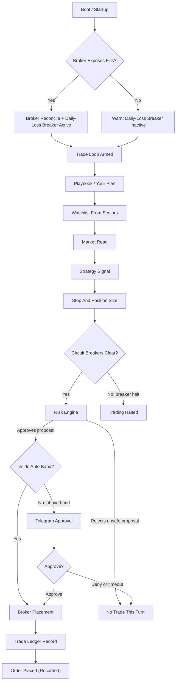

<p align="center">
  
</p>

# BUCKS

**BUCKS is a trading agent — a predator, not an assistant.** The name is a play on
*buck* (the deer) and *bucks* (money): an **8-point buck** with a dollar-sign motif who
works the markets for you inside the guardrails you set. It is not a chatbot you ask
questions; it is a trader you point at the market and let run — carefully, on a leash you
control.

It talks **technical** to a pro (RSI, ATR, position sizing, slippage) and **plain** to a
first-timer, switching by who it is talking to.

> **Honest by design.** BUCKS optimizes for **capability and risk control** — sticking to
> your plan, sizing trades safely, and stopping when it should. **It does not promise
> profit.** Markets carry real risk; no trading software can guarantee gains, and BUCKS
> will never pretend otherwise. There are no fake backtests and no invented "edge."

---

## What you get

- **A working trader on day one** — proven baseline strategies (momentum, mean-reversion,
  breakout) plus a playbook-driven analyst, all behind a risk engine. **BUCKS reads your
  playbook — your risk tolerance, style, and sectors — and builds its OWN watchlist, picks,
  stop distances, and position sizes from it. You don't pick tickers; it's a bot.**
- **Paper trading only.** BUCKS trades in **simulation** with fake money. It cannot
  trade real money.
- **Hybrid autonomy (you stay in control).** Inside a per-trade **size/risk band** you
  set, BUCKS places trades on its own. Anything **bigger than the band** pauses and **asks
  you to Approve in Telegram** — and waits. If you deny it, or you don't answer, it does
  **not** place the trade. Fail-safe, always.
- **Circuit breakers.** A durable kill switch halts trading on a drawdown breach or daily
  loss limit — and stays halted across a restart until you clear it.
- **Your secrets stay protected.** Your broker keys, Telegram token, and AI keys are
  **encrypted at rest** — in your operating system's keychain when available, or in an
  encrypted file (locked by a passphrase) on a headless server. **Never stored in plain
  text, never in an environment variable, never committed to a repo.**

---

## Talk to BUCKS (v1.1)

BUCKS isn't just a config screen — you can **talk to him like a person**:

- **Chat — right on the launch screen.** Open BUCKS (just `bucks`) and start typing at the bottom of the dashboard to talk to him — no separate command. (`bucks chat` still gives you a plain terminal chat if you prefer.) He code-switches plain↔technical, stays honest, and **won't invent your account numbers or promise profit** — any figure about your account is grounded against the real numbers. Chat uses the **AI backend you picked in setup** (or the free Nemotron path below), so it works right after the wizard with no extra setup.
- **Summaries** (`bucks summary`) — a plain-English "here's where you stand" of your P&L, positions, and health, with the numbers checked against reality.
- **Research** (`bucks research "<topic>"`, `bucks read <url>`) — read-only web lookups for market context, every claim traceable to a cited source. No stray orders, no headless browser — it stays one clean binary.
- **A free brain** — no Ollama and no paid key? Pick **Free (NVIDIA Nemotron)** at setup, paste a free `nvapi-` key from build.nvidia.com (~2 min, no card), and you're running. Groq / Cerebras / OpenRouter work the same way.

## Getting started — the guided unwrap

BUCKS ships as a **single file** (one static binary, no installer to fight). The guided
setup walks you through everything on first run: connecting your broker, your Telegram
bot, your AI backend, and writing your **playbook** (how much to risk, your style, your
goals). It runs the **same way on Linux and Windows**.

### Install (one command)

The fastest way in — installs BUCKS if it's missing, **updates** it if it's already
there, and verifies the download against the published checksums before touching your
machine. No download-and-unzip, no admin, no reinstall churn.

**macOS / Linux**
```sh
curl -fsSL https://raw.githubusercontent.com/Tcuzzo/bucks/main/install.sh | bash
```

**Windows (PowerShell)**
```powershell
irm https://raw.githubusercontent.com/Tcuzzo/bucks/main/install.ps1 | iex
```

The binary lands in a user-local folder (`~/.local/bin` on macOS/Linux,
`%LOCALAPPDATA%\BUCKS` on Windows). To **update later**, just re-run the same command —
or run `bucks update`. Then start it with `bucks` (the installer prints how, and the
exact `PATH` line to add if needed). It runs the **same way on Linux and Windows**.

### Download a zip instead (manual)

Prefer to grab it by hand? Download the zip for your computer from the
**[latest release](https://github.com/Tcuzzo/bucks/releases/latest)** (Windows, macOS, or
Linux) — no Go or build tools needed. Or build from source: `git clone` this repo, then
`go build -o bucks ./cmd/bucks`.

#### Linux / macOS
```sh
unzip BUCKS_linux_amd64.zip
cd BUCKS_linux_amd64
./install.sh          # guided unpack - walks you through first-run setup
```

#### Windows
```powershell
# Windows blocks downloaded scripts by default. Allow it for THIS session only:
Set-ExecutionPolicy -Scope Process -ExecutionPolicy Bypass -Force
Expand-Archive BUCKS_windows_amd64.zip
cd BUCKS_windows_amd64
.\install.ps1          # guided unpack - walks you through first-run setup
```

> **Windows PowerShell 5.1 note.** Run each line on its own. Older PowerShell does
> **not** support `&&` to chain commands (`git clone ... && cd ...`) the way Linux/macOS
> shells do — paste the lines one at a time, or use `;` between them. The one-command
> `irm ... | iex` installer above sidesteps both the execution-policy prompt and `&&`
> entirely, so it's the easiest path on Windows.

On first run you'll see the wizard. Answer the questions, and BUCKS connects to your
broker's **paper** account and reaches **"trading (paper)"** — placing and managing
simulated trades inside your band.

After setup, just run `bucks` (or `bucks.exe`) to open the trading dashboard — your
positions and health up top, and a **chat line at the bottom where you can talk to
BUCKS** right there. Or run it headless under a service manager with `bucks --daemon`
to reach him from anywhere over Telegram (see **Run BUCKS 24/7** below).

---

## Real-money trading is not supported

BUCKS cannot trade real money. The broker contract cannot make the broker hold and verify
the protective stop used to calculate position size, and BUCKS has no tested exit path for
closing an open position. The old `--live` flag is rejected with an error.

Real-money trading must not return until broker adapters provide verified bracket or OCO
protection at the broker and BUCKS has a tested exit path. Until both exist, use an Alpaca
paper account.

---

## Run BUCKS 24/7 (always-on Telegram)

BUCKS can run **headless** — no window open, no terminal attached — so you can reach your
trader from anywhere on Telegram. Start it with:

```sh
bucks --daemon
```

That stands up BUCKS's always-on Telegram gateway **and the paper trade loop** — it watches
your simulated account, enforces your drawdown limit and kill switch, and places simulated
trades. It cannot place real-money orders. The **first
time you message your bot, that chat becomes the operator and is remembered** — no env var to
set. Then just message your BUCKS bot:

- **/status** — your paper trading mode, broker, equity, and whether trading is halted
- **/summary** — your equity and realized / unrealized profit-and-loss
- **/positions** — your open positions right now
- **/halt** — stop all trading immediately (it stays stopped, even across a restart)
- **/resume** — start trading again after a halt
- **/help** — show this command list

Only **your** Telegram chat can command BUCKS — anyone else is ignored. Above-band trades
still arrive here as an **Approve / Deny** button, and BUCKS waits for your tap (no answer
means no trade).

To keep it running through reboots and crashes, install it as a background service:

- **Linux / macOS** — use the ready-made systemd unit at
  [`dist/bucks.service`](dist/bucks.service) (`Restart=always`, starts at boot, runs with
  no one logged in). The file's top comment has the exact install steps.
- **Windows** — follow [`dist/bucks-service-windows.md`](dist/bucks-service-windows.md) to
  run it at logon with Task Scheduler, or as a true service with NSSM.

On a server with no system keychain, set `BUCKS_PASSPHRASE` to unlock your encrypted secrets
(without it, the daemon prints a clear message and exits rather than hanging). You do **not**
need to set `BUCKS_TELEGRAM_CHAT_ID` — the first chat to message your bot is paired
automatically and remembered — but you can still set it explicitly to lock the operator chat
ahead of time.

### Keeping BUCKS current

Run **`bucks update`** any time — it checks the latest GitHub release, and on confirmation
downloads, **SHA-256 verifies**, and atomically replaces your binary in place (`bucks update
--check` just reports whether a newer version is out). That is how every fix and feature
reaches you: update once and you are on the latest.

---

## Safety summary (plain English)

- **Paper first.** Simulated money until you choose otherwise.
- **You approve the big ones.** Above-band trades wait for your Telegram "Approve."
- **It stops itself.** Drawdown / daily-loss breakers halt trading and survive restarts.
- **Your keys are encrypted.** Keychain or passphrase-encrypted file — never plaintext.
- **No promises of profit.** BUCKS controls risk and follows your plan; the market does
  the rest.

---

## How a trade turn flows

BUCKS treats each turn as a gated loop: when the broker exposes fills, startup
reconciliation and the daily-loss breaker engage before the loop arms; otherwise BUCKS
still runs but loudly warns that the daily-loss breaker is inactive. From there, your
playbook, market read, signal, risk gate, and optional approval decide whether an order
reaches the broker and gets recorded in the trade ledger.



---

## Under the hood

For the curious, BUCKS is built like a piece of trading infrastructure, not a script:

- **Crash recovery is broker-grounded.** Every order carries a deterministic idempotency key
  (`clOrdID`), so a retry after a crash cannot double-place at the venue. BUCKS reconciles
  against the broker's own activity stream — its authoritative record of fills and realized
  P&L — on startup and as it runs, so its view stays matched to broker truth. The
  `fsync` order-intent journal and WAL reconcile path are tested durability components, but
  they are not yet wired into paper order placement.
- **One engine, two clocks.** The same deterministic event engine runs both backtests and the
  paper trade loop, proven by a bit-for-bit replay test.
- **Exact money math.** Prices, sizes, and P&L use fixed-point decimals end to end. No float
  rounding ever touches your money.
- **One static file.** Pure Go, no C dependencies — a single binary that cross-compiles to
  Linux, Windows, and macOS, including an embedded pure-Go database.
- **Honest AI.** The optional LLM analyst is grounded against real evidence; unsupported claims
  are flagged, never presented as fact. No fabricated edge.

Go ~1.26. Built test-first; the suite covers the engine, the safety layer, and the unwrap path,
including a strict race-condition pass.

## License & credits

BUCKS is **MIT licensed** (see `LICENSE`). It links several excellent open-source Go
libraries, all under permissive licenses — credited in `NOTICE`. A build-time license
gate **hard-fails on any copyleft (A)GPL/LGPL dependency**, so BUCKS stays cleanly MIT.

The trading-engine patterns BUCKS uses (a deterministic event kernel, an order durability
spine, a capability probe) were **studied from the best prior art and re-implemented as
BUCKS's own** — inspired by, not copied. Details in `NOTICE`.

## Part of a family

BUCKS is one of a family of local-first, operator-owned agents: your machine, your
keys, your models, and a clear safety model. Its public sibling is
[HydraAgent_public](https://github.com/Tcuzzo/HydraAgent_public), a local coding &
ops agent.
