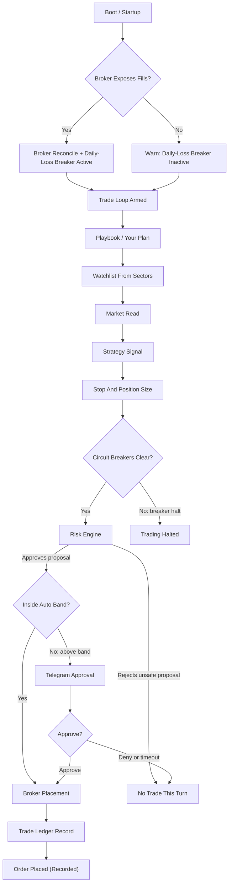

<p align="center">
  
</p>

<picture>
  <source media="(prefers-color-scheme: dark)" srcset="assets/reflex-seam-dark.svg">
  
</picture>

# BUCKS

**The model decides. The runtime owns your money, your limits, and your kill switch —
and if the model reaches past a limit it does not own, BUCKS refuses out loud instead
of guessing.**

Watch it happen. The analyst says *buy this, size it here*. The risk engine checks the
number against your band. Above the band, the order does not go anywhere — it goes to
your phone and waits for your tap. No tap, no trade. The model does not get a vote on
that, and it cannot talk its way past it, because the band is code, not instruction.

That line is the **Reflex Seam**, and in a trading agent it is the thing that matters
most. A hallucination in a chatbot is an annoying answer. A hallucination in a trading
agent moves money. BUCKS trades on paper only and refuses live trading outright, so
nothing here can cost you a dollar today — but the harness is built as though it could.
Bad logic is stopped **before** it crosses the execution boundary, not after: the
circuit breakers and the approval gate sit between the model's judgment and any order.

Two rules ride along. **No mock theater:** the tests fake the broker and the network,
and nothing else — the money math, the journal, and the breakers are tested for real
(there is a whole section on this below). **Builder is not grader:** the failing test
comes first, and something that did not write the code has to pass it.

> **Honest by design.** BUCKS optimizes for capability and risk control — sticking to
> your plan, sizing safely, and stopping when it should. **It does not promise
> profit.** No trading software can. There are no fake backtests here and no invented
> edge.

MIT · Linux / macOS / Windows · one static binary

---

## What this does

BUCKS is a trading agent you run on your own machine. It is not a chatbot you ask
questions. It is a trader you point at the market and let run, on a leash you hold.

The name is a play on *buck* (the deer) and *bucks* (money): an 8-point buck with a
dollar-sign motif who works the markets inside the guardrails you set.

It reads **your playbook** — your risk tolerance, your style, your sectors — and builds
its own watchlist, picks, stop distances, and position sizes from it. You do not pick
tickers. It is a bot.

It talks technical to a pro (RSI, ATR, position sizing, slippage) and plain to a
first-timer, switching by who it is talking to.

## Why it exists

The hole this was built to close: when the model that picks the trade is also the thing
deciding whether the trade is safe, that is a model grading its own homework with your
account as the stake. That is an opinion about design, and it is the opinion this whole
repo is built on — judge it by the code below, not by the sentence.

BUCKS splits those jobs and puts a wall between them. The model reads the market and
proposes. The runtime owns the position sizing, the stop distance, the drawdown
breaker, the daily-loss breaker, the kill switch, and the approval gate. The model
cannot reach any of it. When it tries, the attempt is refused loudly and written down.

**Paper only, and that is a design decision, not a limitation we are apologizing for.**
BUCKS trades in simulation with fake money on Alpaca's paper API. Alpaca live and
Tradier connections are monitor-only. Placement to any real-money venue is refused at
several layers, and the old `--live` flag now returns an error.

You can check that yourself: pass `--live` and it returns an error. Real money stays off
until two things exist — broker adapters that provide verified bracket or OCO protection
**at the broker**, and a tested exit path for closing an open position. Today the broker
contract cannot guarantee it holds the protective stop that the position size was
calculated from. Shipping real-money trading without that is how people get hurt.

## How it fits

BUCKS is the high-stakes member of a family of local-first, operator-owned agents.

- **[HydraAgent_public](https://github.com/Tcuzzo/HydraAgent_public)** — a local coding
  and ops agent. Same seam, lower stakes.
- **[BACKS AIOS Skills](https://github.com/Tcuzzo/backs-aios-skills)** — the harness
  discipline as 28 portable skills any agent can load.

Shared spine: your machine, your keys, your models, a safety model you can read in one
sitting, and a Telegram remote.

## Risk bands — the limits and the approval flow

This is the part to actually read.

**Inside the band, BUCKS trades on its own.** The band is sized from the capital you
set: roughly up to 5% notional and 1% risk per trade, with sane floors for small
accounts.

**Above the band, it stops and asks.** The trade goes to Telegram as an Approve / Deny
button, and BUCKS waits. Deny it, or say nothing at all, and the trade does not happen.
Silence is a no. That is the fail-safe direction, always.

**Circuit breakers stop everything.** A drawdown breach trips a durable kill switch —
trading stays halted **across restarts** until you clear it yourself. A separate
daily-loss circuit halts trading for the rest of the day and resets when the daily P&L
window rolls over.

**Your keys are encrypted at rest.** Your operating system's keychain when there is
one, or a passphrase-locked encrypted file on a headless server. Never plaintext, never
committed. The only environment-variable paths are opt-ins you set yourself:
`BUCKS_PASSPHRASE` to unlock the encrypted file on a server, plus the optional
`BUCKS_CHAT_*` and `BUCKS_TELEGRAM_BOT_TOKEN` overrides.

Here is a full turn, gate by gate:


```mermaid
flowchart TD
    Boot["Boot / Startup"]
    BrokerFills{"Broker Exposes Fills?"}
    BrokerReconcile["Broker Reconcile + Daily-Loss Breaker Active"]
    InactiveDailyLoss["Warn: Daily-Loss Breaker Inactive"]
    LoopArmed["Trade Loop Armed"]
    Playbook["Playbook / Your Plan"]
    Watchlist["Watchlist From Sectors"]
    MarketRead["Market Read"]
    StrategySignal["Strategy Signal"]
    TradeProposal["Stop And Position Size"]
    CircuitBreakers{"Circuit Breakers Clear?"}
    RiskEngine["Risk Engine"]
    RiskBand{"Inside Auto Band?"}
    TelegramApproval["Telegram Approval"]
    OperatorChoice{"Approve?"}
    BrokerPlacement["Broker Placement"]
    TradeLedger["Trade Ledger Record"]
    PlacedTrade["Order Placed (Recorded)"]
    NoTrade["No Trade This Turn"]
    TradingHalted["Trading Halted"]

    Boot --> BrokerFills
    BrokerFills -- "Yes" --> BrokerReconcile
    BrokerFills -- "No" --> InactiveDailyLoss
    BrokerReconcile --> LoopArmed
    InactiveDailyLoss --> LoopArmed
    LoopArmed --> Playbook
    Playbook --> Watchlist
    Watchlist --> MarketRead
    MarketRead --> StrategySignal
    StrategySignal --> TradeProposal
    TradeProposal --> CircuitBreakers
    CircuitBreakers -- "No: breaker halt" --> TradingHalted
    CircuitBreakers -- "Yes" --> RiskEngine
    RiskEngine -- "Rejects unsafe proposal" --> NoTrade
    RiskEngine -- "Approves proposal" --> RiskBand
    RiskBand -- "Yes" --> BrokerPlacement
    RiskBand -- "No: above band" --> TelegramApproval
    TelegramApproval --> OperatorChoice
    OperatorChoice -- "Deny or timeout" --> NoTrade
    OperatorChoice -- "Approve" --> BrokerPlacement
    BrokerPlacement --> TradeLedger
    TradeLedger --> PlacedTrade
```

Notice where the model is on that chart. It reads the market and produces a signal.
Everything after `TradeProposal` is the runtime. That is the seam.

## Quick start

One command:

```sh
# Linux / macOS
curl -fsSL https://raw.githubusercontent.com/Tcuzzo/bucks/main/install.sh | sh
```

```powershell
# Windows — it blocks downloaded scripts by default, so allow it for THIS session only
Set-ExecutionPolicy -Scope Process -ExecutionPolicy Bypass
irm https://raw.githubusercontent.com/Tcuzzo/bucks/main/install.ps1 | iex
```

Then run `bucks`. The first launch is a setup wizard; after that it opens the trading
dashboard — positions and health up top, and a chat line at the bottom where you talk
to BUCKS directly.

**No Ollama and no paid key?** Pick **Free (NVIDIA Nemotron)** in setup, paste a free
`nvapi-` key from build.nvidia.com — about two minutes, no card — and you are running.
Groq, Cerebras, and OpenRouter work too: set `BUCKS_CHAT_PROVIDER=groq|cerebras|openrouter`
and `BUCKS_CHAT_KEY`. The base URL and model default sensibly;
`BUCKS_CHAT_BASEURL` / `BUCKS_CHAT_MODEL` / `BUCKS_CHAT_VOICE` override them.

Prefer a zip? Grab a release archive, unpack it, and put the binary on your `PATH`.

## Talk to it

| Command | What it does |
| --- | --- |
| `bucks` | The dashboard, with a chat line. Also runs the Telegram gateway while open. |
| `bucks --daemon` | Headless, under a service manager. Always-on Telegram. |
| `bucks --paper-smoke` | Boot the saved config, place one in-band paper trade, exit. |
| `bucks chat` | Terminal REPL, configured by the `BUCKS_CHAT_*` variables. |
| `bucks summary` | Plain-English take on your positions and P&L. |
| `bucks research "<q>"` · `bucks read <url>` | Read-only web lookups, every claim cited. |
| `bucks doctor` | Updates, Go dependencies, vulnerabilities. |
| `bucks update [--yes] [--force]` | Update to the latest release, SHA-256 verified. |
| `bucks version` · `bucks logo` | Build info; the brand mark. |

Flags: `--config <path>` picks a config file, `--chat` is the flag form of
`bucks chat`, and `--live` returns an error — BUCKS cannot trade real money.

Any figure BUCKS gives you about your account is checked against the real numbers
before it reaches you. It will not invent an account balance and it will not promise
profit.

## Run it 24/7

```sh
bucks --daemon
```

That stands up the always-on Telegram gateway **and** the paper trade loop. It watches
your simulated account, enforces your drawdown limit and kill switch, and places
simulated trades. It cannot place real-money orders.

The **first chat to message your bot becomes the operator** and is remembered. No
environment variable to set. Then, from your phone:

- **/status** — mode, broker, equity, and whether trading is halted
- **/summary** — equity, realized and unrealized P&L
- **/positions** — what is open right now
- **/halt** — stop everything, and it stays stopped across a restart
- **/resume** — start again
- **/help** — the list

Only your chat can command BUCKS. Everyone else is ignored.

To survive reboots: **Linux and macOS** use the systemd unit at
[`dist/bucks.service`](dist/bucks.service) (`Restart=always`, starts at boot, no login
needed) — install steps are in its top comment. **Windows** follows
[`dist/bucks-service-windows.md`](dist/bucks-service-windows.md) for Task Scheduler or
NSSM.

On a server with no keychain, set `BUCKS_PASSPHRASE`. Without it the daemon prints a
clear message and exits, rather than hanging and looking alive.

## No mock theater

A test that passes while the thing is broken is worse than no test. In a trading agent
it is a loaded gun. So the rule here is narrow and strict: **mocks stop at the network
boundary.** The broker is faked because no test should send an order to a real venue.
The Telegram transport is faked. The LLM backend is faked. Everything on this side of
that line is tested for real.

Run it yourself:

```sh
git clone https://github.com/Tcuzzo/bucks.git
cd bucks
go test ./...              # the suite
go test -race ./...        # the strict race pass
```

No number is quoted here on purpose. A test count in a README is a thing you cannot
check, and this file does not ask you to trust it. Two things you *can* check: the
commands above, on your own machine, and
[`.github/workflows/ci.yml`](.github/workflows/ci.yml) — every push runs the secret scan,
`go vet`, `govulncheck`, the copyleft license gate, `go test ./...`, **and** the race
pass, on GitHub's runners. Read the workflow, then look at the Actions tab.

What "for real" means here, with names you can open:

- **`internal/orders/journal_test.go`** — writes a real order-intent journal to a real
  file on disk, closes it, then replays it from disk and proves the order lands in the
  exact terminal state. It also proves a crash after the intent, a send with no
  terminal record, and a **truncated trailing line** all replay correctly. Those are
  real files, really truncated.
- **`internal/kernel/replay_test.go`** — the same deterministic engine runs a backtest
  and the paper loop, and the test proves both produce **bit-for-bit identical state**
  from identical events. One engine, two clocks.
- **`internal/risk/killswitch_test.go`** — the one that backs the headline claim.
  `TestKillSwitch_HaltPersistsAndSurvivesRestart` trips the switch, writes to a real
  file in a real directory, then **reopens it from disk** and proves it is still
  halted. `TestKillSwitch_ClearIsExplicitOnlyAndNoAutoResume` proves nothing
  auto-resumes trading. `TestKillSwitch_CorruptFileFailsSafeHalted` corrupts the file
  and proves BUCKS fails **halted**, not open.
- **`internal/brokers/reconcile_test.go`** — reconciliation against the broker's own
  activity stream, so BUCKS's view of your account matches broker truth rather than its
  own memory.

The only things faked are the broker, the Telegram transport, and the LLM backend —
every one of them a network boundary no test should cross. The broker's *own* halt
capability is faked for the same reason; BUCKS's own kill switch is not.

**Builder is not grader.** A change starts with a test that fails for the stated
reason. Then the code. Then something that did not write it has to pass it. When a
model reviews, it is a model from a different family than the one that wrote the
change.

## What breaks it

The honest list.

- **Real-money trading is not supported.** By design, and it is not coming back until
  broker-held bracket or OCO protection is verified and a tested exit path exists.
- **The daily-loss breaker needs broker fills.** If your broker does not expose fills,
  BUCKS still runs — but it warns loudly that the daily-loss breaker is inactive
  instead of quietly pretending it is armed.
- **The `fsync` order-intent journal and the WAL reconcile path are tested durability
  components that are not yet wired into paper order placement.** They work; they are
  not on the paper path yet. Said plainly because a half-wired safety feature that
  reads as finished is exactly the kind of thing that gets somebody hurt.
- **No promises of profit, ever.** BUCKS controls risk and follows your plan. The
  market does what it does.

## Build from source

```sh
git clone https://github.com/Tcuzzo/bucks.git
cd bucks
go build ./cmd/bucks
go test ./...
go test -race ./...
```

Go ~1.26. Pure Go, no C dependencies, including an embedded pure-Go database — it
cross-compiles to Linux, Windows, and macOS as a single static binary.

Under the hood, for the curious:

- **Crash recovery is broker-grounded.** Every order carries a deterministic
  idempotency key (`clOrdID`), so a retry after a crash cannot double-place at the
  venue. BUCKS reconciles against the broker's authoritative activity stream at startup
  and as it runs.
- **Exact money math.** Prices, sizes, and P&L are fixed-point decimals end to end. No
  float rounding ever touches your money.
- **Honest AI.** The optional LLM analyst is grounded against real evidence. An
  unsupported claim gets flagged, not presented as fact.

## Contributing

Same rules the agent lives by.

1. **Write the failing test first.** It has to fail for the reason you say.
2. **Then the code.** Smallest change that turns it green.
3. **Do not grade your own work.** Something that did not write the change has to pass
   it. If a model reviews, use a different family than the one that wrote it.
4. **Mocks stop at the network boundary.** Fake the broker. Never fake the risk math,
   the journal, or the breakers.
5. **Loud over quiet.** A safety feature that cannot arm says so and stops.

Start with [CONTRIBUTING.md](CONTRIBUTING.md). Security issues go through
[SECURITY.md](SECURITY.md) — please do not open a public issue for a vulnerability.

## License and credits

**MIT** — see `LICENSE`. BUCKS links several excellent open-source Go libraries, all
permissively licensed and credited in `NOTICE`. A build-time license gate **hard-fails
on any copyleft or weak-copyleft dependency** ((A)GPL, LGPL, MPL, EPL, CDDL), so BUCKS
stays cleanly MIT.

The trading-engine patterns — a deterministic event kernel, an order durability spine,
a capability probe — were studied from prior art and re-implemented here. Inspired by,
not copied. Provenance is a maintainer's statement of record, not something a repo can
prove about itself; the specifics are written down in `NOTICE`, so you can read exactly
what is being claimed and check the code against it.
